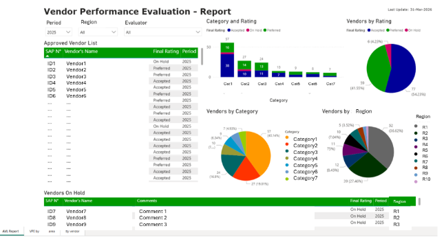

# 📊 Data Analytics Project | Supplier Performance Analytics System

## 🚀 Overview
This project presents an **end-to-end digital Supplier Evaluation System** developed using **Power Apps, Power BI, and SharePoint** to streamline **vendor performance assessment** and enable **data-driven supplier management**.

The solution integrates **data collection, storage, automation, and reporting**, allowing organizations to monitor supplier performance and improve decision-making through **business intelligence (BI)**.

---

## 🎯 Business Context
Organizations managing multiple suppliers require efficient and standardized evaluation processes.  

This solution was developed to:
- Digitize supplier evaluation workflows  
- Improve **data collection efficiency and standardization**  
- Provide **real-time performance insights**  
- Enable **KPI tracking and supplier monitoring**  

---

## ⚠️ Data Disclaimer
Due to **confidentiality constraints**, datasets are not included.  

This project demonstrates:
- End-to-end system design  
- Data integration architecture  
- KPI visualization and reporting  
- Business intelligence capabilities  

---

## 🏗️ Solution Architecture
The system integrates multiple components within the **Microsoft Power Platform**:

- **Power Apps** → User interface for data entry and evaluation management  
- **SharePoint** → Centralized and scalable data repository  
- **Power Automate** → Automated notifications and reminders  
- **Power BI** → Data visualization and performance analysis  

---

## 📊 Application & Dashboard Overview

### 🔹 Power Apps Application (Data Collection Layer)
Designed a user-friendly application to:
- Input and manage supplier evaluations  
- Standardize evaluation processes  
- Improve data quality and accessibility  

#### Application Screens

---

### 🔹 Supplier Evaluation System (End-to-End Flow)
Integrated solution combining:
- Power Apps for survey input  
- Power Automate for reminders  
- SharePoint for data storage  
- Power BI for analytics and reporting  

---

### 🔹 Power BI Dashboard – Supplier Analysis
Interactive dashboards displaying:
- Supplier classification and evaluation results  
- Vendor segmentation by service category  
- Performance scores and KPI metrics  
- Regional distribution of supplier evaluations  

---

### 🔹 Power BI – Performance Monitoring & Trends
Dedicated page for:
- Supplier performance tracking  
- Historical trend analysis  
- Multi-year KPI evolution  

---

## 📈 Key Features
- **End-to-end digitalization of supplier evaluation process**
- **Multi-platform integration (Power Apps + SharePoint + Power BI)**
- **Automated workflows using Power Automate**
- **Real-time KPI tracking and monitoring**
- **Interactive dashboards and reporting**
- **Supplier segmentation and classification**
- **Historical performance analysis**
- **Data-driven supplier management**

---

## 🧠 Data & Process Flow
1. Data input via **Power Apps**
2. Data storage in **SharePoint lists**
3. Workflow automation with **Power Automate**
4. Data visualization in **Power BI dashboards**

---

## 📊 Analysis & Insights
The solution enables:
- Identification of top and low-performing suppliers  
- Analysis of supplier performance trends over time  
- Segmentation of suppliers by category and region  
- Monitoring of compliance and evaluation scores  

---

## 🛠️ Tools & Technologies
- **Power BI**
- **Power Apps**
- **SharePoint**
- **Power Automate**
- **Data Integration**
- **Data Visualization**
- **Business Intelligence (BI)**
- **KPI Tracking**
- **Dashboard Development**
- **Performance Analytics**

---

## 💼 Business Impact
- Improved **supplier evaluation efficiency**
- Reduced manual data collection processes  
- Enabled **real-time supplier performance monitoring**
- Enhanced **data-driven decision-making**
- Standardized evaluation methodology across the organization  

---

## 📌 Key Skills Demonstrated
- **Data Analytics**
- **Business Intelligence**
- **Power Platform (Power Apps, Power BI, SharePoint, Power Automate)**
- **Data Integration**
- **KPI Monitoring & Reporting**
- **Supplier Performance Analysis**
- **Dashboard Development**
- **Process Digitalization**
- **Automation & Workflow Design**

---

## 🔮 Future Improvements
- Integration with ERP systems  
- Predictive analytics for supplier risk assessment  
- Advanced scoring models  
- Expanded automation workflows  

---

## 📄 Notes
This project demonstrates real-world application of **Power Platform technologies** to solve business challenges, aligning with industry requirements for **Data Analyst**, **Business Intelligence Analyst**, and **Digital Transformation roles**.
